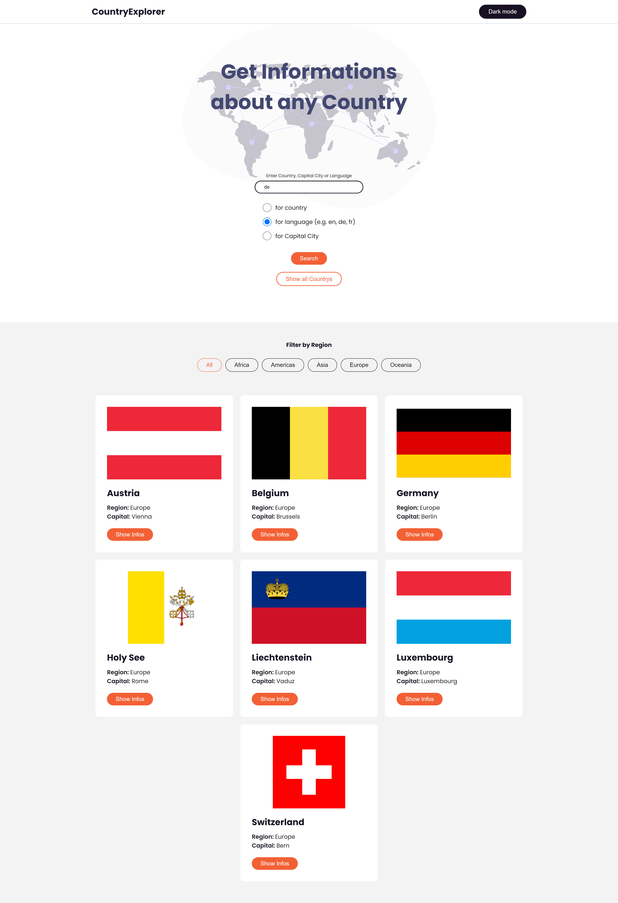
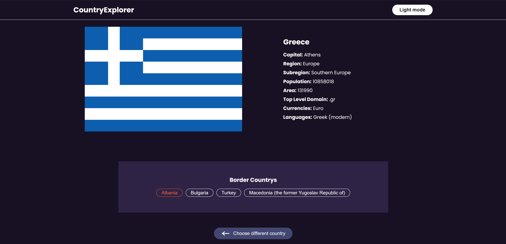

# Country Information

Website to find country information. Information is pulled from the [Rest Countries API](https://restcountries.eu/). Countries can be searched by country name, capital city, language or it is possible to show all countries. The resulting list can be filtered by region.

Built with: HTML, Scss, BEM, Javascript

Link to demo: [Demo](https://stefanturner.ch/countries/)
## Screenshots

----

